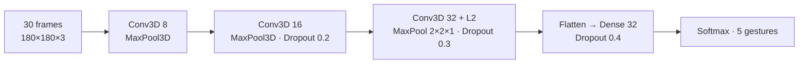

# ✋ Video Gesture Recognition — 3D CNNs vs. CNN-RNN Hybrids


> Recognising **5 hand gestures from short video clips** — enabling touch-free control of devices such as a smart TV. **9 architectures** were compared — from plain Conv3D to Conv3D+GRU, CNN+LSTM and ConvLSTM — to find the best accuracy-vs-overfitting trade-off.

**Final model:** lightweight 3-block Conv3D network · **~479 K parameters** · **val. accuracy ≈ 78%** with train ≈ 76% (no over-fitting).

---

## 📌 Problem

Each input is a **sequence of 30 frames**. The model must learn both **spatial** features (hand shape) and **temporal** features (direction of motion) to classify the gesture into one of 5 commands.

## ⚙️ Data Pipeline

A custom Python **generator** feeds the model in batches, so the full video dataset never has to fit in memory:

- selects the frames for each video (30 per clip),
- resizes frames of two different source resolutions to a fixed **180×180**,
- normalises pixels to [0, 1],
- yields `(batch, frames, height, width, channels)` tensors and handles the final partial batch.

## 🔬 Experiments

| # | Architecture | Val. accuracy | Observation |
|---|---|---|---|
| 1 | Conv3D | 0.84 (peak) | Training hits 100% → **severe over-fitting** |
| 2 | Conv3D (variant) | 0.79 | Same over-fitting pattern |
| 3 | Conv3D + L1/L2 + BatchNorm + Dropout | 0.76 | More stable, occasional loss spikes |
| 4 | + Global Average Pooling | 0.52 | Over-regularised → under-fits |
| 5 | + Spatial Dropout | 0.47 | Over-regularised → under-fits |
| 6 | Conv3D + **GRU** | 0.74 | Good temporal modelling, unstable early training |
| 7 | TimeDistributed Conv2D + **LSTM** | 0.59 | Over-fits (train ~99%) |
| 8 | **ConvLSTM2D** + Dropout | 0.56 | Captures spatio-temporal patterns, unstable |
| **Final** | **Compact Conv3D (8→16→32 filters) + Dropout + L2 + LR scheduling** | **~0.78** | **Best generalisation — train and val. curves converge** |



## 💡 Key Findings

- The **highest peak accuracy is not the best model**: Experiment 1 reached 0.84 but memorised the training set.
- **Too much regularisation hurts** (Experiments 4–5): tuning *how much* regularisation matters as much as adding it.
- **Hybrid CNN-RNN models** are promising for temporal patterns but need more data and careful tuning to train stably.
- A **small, well-regularised Conv3D** gave the best balance of accuracy, stability and model size (~479 K params — suitable for an edge device such as a TV).

## 🔭 Next Steps

- Transfer learning with a pre-trained 2D backbone (e.g. MobileNet) + GRU.
- Temporal data augmentation (frame skipping, speed jitter).
- Attention over frames; quantisation for on-device inference.

## 🚀 How to Run

```bash
git clone https://github.com/AnishRane-cox/Gesture-Recognition-using-3D-CNN.git
cd Gesture-Recognition-using-3D-CNN
pip install tensorflow numpy opencv-python scikit-image matplotlib jupyter
jupyter notebook Neural_Nets_Project.ipynb
```

Update the train/validation folder paths in the notebook to point to the gesture dataset. A GPU is strongly recommended.

## 📁 Repository Structure

```
├── Neural_Nets_Project.ipynb   # Generator, 9 experiments, final model
├── Write Up.docx               # Detailed experiment write-up
├── LICENSE
└── README.md
```

---

## 👤 Author

**Anish Rane** — Data & AI Engineer · MSc Machine Learning & AI (LJMU) · Mechanical Engineer

[](https://anishrane-cox.github.io/Portfolio/)
[](https://www.linkedin.com/in/anish-rane/)
[](https://github.com/AnishRane-cox)

⭐ If you found this useful, consider starring the repo.
